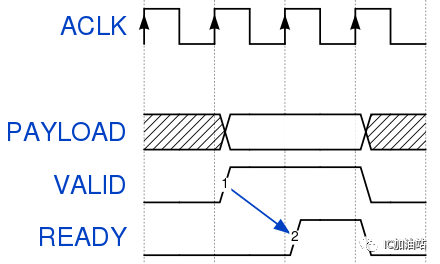
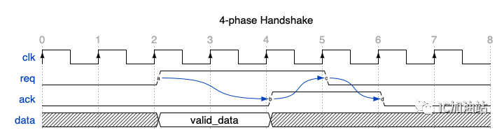
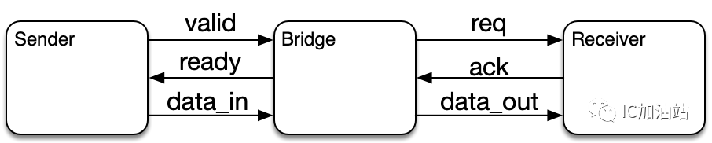
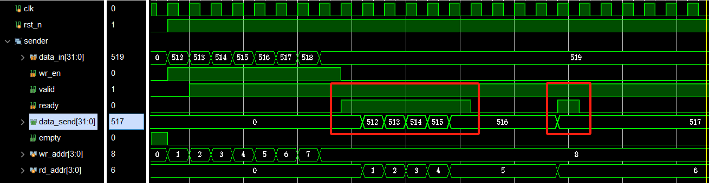
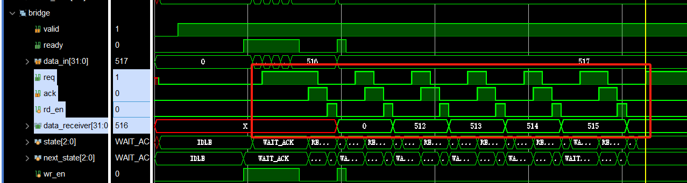

#### [题目来源](https://mp.weixin.qq.com/s/EDAjjVJzzyKstI10fqv6Lw)
#### [相关博客](https://zhuanlan.zhihu.com/p/620498057)
# Valid-Ready Handshake

对于Sender来说，不能依据ready来决定要不要拉高valid；
对于Receiver来说，不能依据valid来决定要不要拉高ready;
valid&ready同时拉高多少个周期就传多少个数据。
# 4-phase Handshake

1. phase1: sender和receiver都是idle状态，req和ack都为0；如上图的cycle 0, 1
2. phase2:  sender拉高req，等待receiver的ack为高，同时驱动要传输的数据，并保持住; 如上图的cycle 2, 3
3. phase3: receiver拉高ack，此时req和ack同时为高；表示receiver已经接受到了数据；如上图的cycle 4
4. phase4: sender看到了ack，知道数据传输完成，于是拉低req。如上图cycle 5最后receiver看到req被拉低，从而也拉低ack，回到phase1，即上图的cycle 6, 7。
5. 也就是每一次传输数据，都需要经过a->b, b->c, c->d的顺序变化。和valid-ready协议有相似点，但是也有不同点。
相似点：req(valid)变高的时候，sender就需要drive valid data
不同点：valid-ready的valid在传输完一个数据之后可以不拉低，在下一个周期紧接着传输下一个数据，但是4-phase handshake必须要走完4个phase，即看到ack为1了之后必须要将req拉低，否则receiver的ack也不会拉低，receiver也不会认为一个新的传输开始。
# Bridge设计

## 设计思路
1. Sender模块存储需要发送的数据，当Sender非空时对Bridge发送valid信号，bridge发送ready信号，两个信号都为高时开始传递数据，ready&valid持续几个周期就发送几个数据。
2. Bridge接收到数据后，状态机进行跳转，向Receiver发送req信号。
3. Receiver发送ack信号给bridge，然后Bridge传输一个信号给Receiver。之后req拉低，一个周期后，ack拉低。在req和ack同时拉低之后，开始接收数据
## 仿真结果
1. Sender发送数据
   
   valid和ready同时拉高时，发送数据。
2. Bridge发送数据给Receiver
   
   req和ack为均1变成均为0之后，表示握手完成，从fifo中读取一个数据。

   
