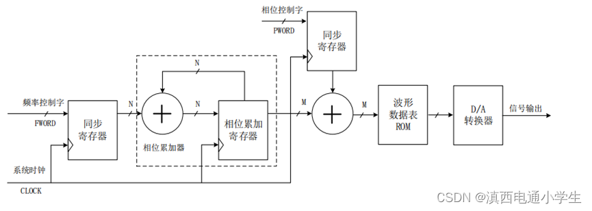
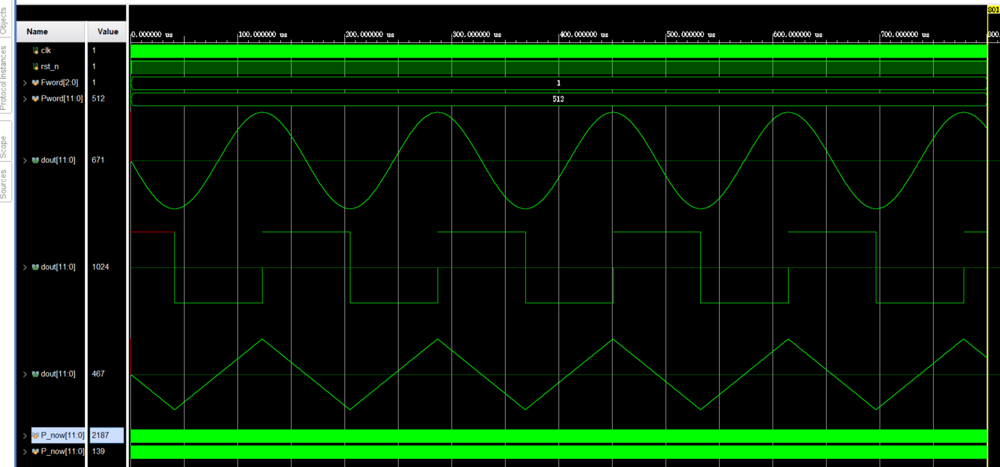
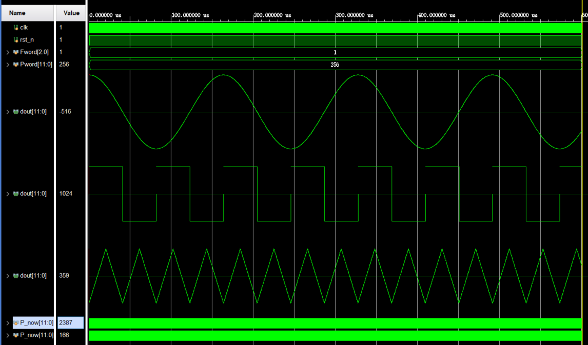

[verilog代码编写DDS](https://blog.csdn.net/qq_46132759/article/details/122651657)
[彻底理解DDS（信号发生器）的fpga实现（verilog设计代码](https://blog.csdn.net/qq_44366923/article/details/125779015)
[简易DDS信号发生器的设计与验证](https://blog.csdn.net/m0_51133942/article/details/138140087?utm_medium=distribute.pc_relevant.none-task-blog-2~default~baidujs_baidulandingword~default-0-138140087-blog-125779015.235^v43^pc_blog_bottom_relevance_base2&spm=1001.2101.3001.4242.1&utm_relevant_index=3)

# DDS设计
#### 1. DDS是直接数字式频率合成器(Direct Digital Synthesizer )的英文缩写。其结构如下：

由图可以看出，DDS 主要由相位累加器、相位调制器、波形数据表以及D/A 转换器构成。本次实验仅在VIVADO平台上完成DDS的仿真，故设计流程不需要D/A转换器，在PC端完成仿真设计即可。若需要结合FPGA开发板使用，则需要再外接一个D/A转换模块，将产生的数字信号转换为模拟信号即可。
#### 2. 通过将波形数据存储到RAM中，早根据初始相位和频率从RAM中去电输出，就能实现简单的DDS。
#### 3. DDS的实现所需的两个重要参数：
   **频率控制字Fword**：即点数间隔，比如我们把一个正弦波形分为1024个点，而RAM容量为512，那么我们的点数间隔就要取1024/512=2。即频率控制字为2，可以理解为每次的步进长度。
   **相位控制字Pword**：选取的初始点,起始相位.
   选择了起始相位和步进长度，则可以按照一定的时钟，产生顺序的相位值，将该值作为ROM查找表的地址，即可顺序读出存储的正弦波表数据，作为数据输出，同样的，为了产生其他不同类型的波形，只需要改变波表数据即可。

#### 4. 利用设计好的可配置单端口RAM，将RAM深度设置为4096，即[11:0]，将脚本生成的三角波、正弦波、方波数据存入RAM。

#### 5.结果展示
   在tb中例化3个DDS单元，提高对比性。下面图中：三种波形的初相位均为0，步进长度为1
     
   对初相位和不仅长度进行配置后，结果如下:
   
   上图中，步进长度以及为1、2、4.可以看到频率逐渐加快。

###
     