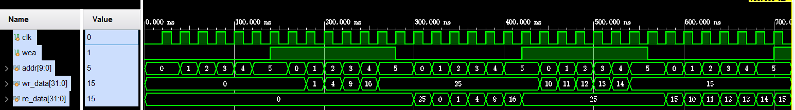

[IP核调用](https://blog.csdn.net/qq_40807206/article/details/109685727)
[三种RAM的实现](https://blog.csdn.net/Loudrs/article/details/130956115#:~:text=%E5%8D%95%E7%AB%AF%E5%8F%A3RAM%EF%BC%88Single-port%20RAM%EF%BC%89%EF%BC%9A%20%E8%BE%93%E5%85%A5%E5%8F%AA%E6%9C%89%E4%B8%80%E7%BB%84%E6%95%B0%E6%8D%AE%E7%BA%BF%E5%92%8C%E4%B8%80%E7%BB%84%E5%9C%B0%E5%9D%80%E7%BA%BF%EF%BC%8C%E8%AF%BB%E5%86%99%E5%85%B1%E7%94%A8%E5%9C%B0%E5%9D%80%E7%BA%BF%EF%BC%8C%E8%BE%93%E5%87%BA%E5%8F%AA%E6%9C%89%E4%B8%80%E4%B8%AA%E7%AB%AF%E5%8F%A3%E3%80%82,%E8%BF%99%E6%84%8F%E5%91%B3%E7%9D%80%EF%BC%8C%E5%A6%82%E6%9E%9CCPU%E9%9C%80%E8%A6%81%E8%AF%BB%E5%8F%96RAM%E4%B8%AD%E7%9A%84%E6%95%B0%E6%8D%AE%E5%B9%B6%E5%B0%86%E5%85%B6%E5%86%99%E5%85%A5%E5%8F%A6%E4%B8%80%E4%B8%AA%E4%BD%8D%E7%BD%AE%EF%BC%8C%E5%BF%85%E9%A1%BB%E5%85%88%E6%89%A7%E8%A1%8C%E8%AF%BB%E5%8F%96%E6%93%8D%E4%BD%9C%EF%BC%8C%E7%84%B6%E5%90%8E%E6%89%A7%E8%A1%8C%E5%86%99%E5%85%A5%E6%93%8D%E4%BD%9C%E3%80%82%20%E8%BF%99%E7%A7%8D%E5%BB%B6%E8%BF%9F%E5%8F%AF%E8%83%BD%E4%BC%9A%E5%BD%B1%E5%93%8D%E8%AE%A1%E7%AE%97%E6%9C%BA%E7%B3%BB%E7%BB%9F%E7%9A%84%E6%80%A7%E8%83%BD%E3%80%82%20%E5%8D%95%E7%AB%AF%E5%8F%A3RAM%E9%80%9A%E5%B8%B8%E7%94%A8%E4%BA%8E%E4%BD%8E%E7%AB%AF%E8%AE%A1%E7%AE%97%E6%9C%BA%E7%B3%BB%E7%BB%9F%E6%88%96%E5%B5%8C%E5%85%A5%E5%BC%8F%E7%B3%BB%E7%BB%9F%E4%B8%AD%E3%80%82)
[coe文件的导入](https://blog.csdn.net/weixin_43812576/article/details/136462841)
[双口伪RAMIP核使用](https://blog.csdn.net/qq_39507748/article/details/109218201)
[双口真RAMIP核使用](https://blog.csdn.net/zengaliang/article/details/78765159?spm=1001.2101.3001.6650.5&utm_medium=distribute.pc_relevant.none-task-blog-2%7Edefault%7EBlogCommendFromBaidu%7ERate-5-78765159-blog-109218201.235%5Ev43%5Epc_blog_bottom_relevance_base2&depth_1-utm_source=distribute.pc_relevant.none-task-blog-2%7Edefault%7EBlogCommendFromBaidu%7ERate-5-78765159-blog-109218201.235%5Ev43%5Epc_blog_bottom_relevance_base2&utm_relevant_index=10)
[RAM IP Core中 Write First Read First和No Change的区别](https://cloud.tencent.com/developer/article/1652299)
[【FPGA】 单端口RAM 双端口RAM 读写冲突 写写冲突](https://blog.csdn.net/as480133937/article/details/134387705?fromshare=blogdetail&sharetype=blogdetail&sharerId=134387705&sharerefer=PC&sharesource=m0_65068279&sharefrom=from_link)

# RAMIP核使用
## 读写冲突
### 当**读和写共用同一个地址**时，可采用三种配置来解决冲突问题
#### 1. 读优先(read first)：在读写冲突的情况下，优先进行读操作。读完再写；对于读优先，先读再写。
#### 2. 写优先(write first)：在读写冲突的情况下，优先进行写操作。
#### 3. 保持(no change)：在写操作后，保持输出数据不变，即使有新的写入操作。
   
## 单端口RAM：
#### 1. 一个端口，可读可写，但是不能同时进行，共用同一个地址线。所调用IP核界面如下：
 
#### 2. wea=1时，写使能；wea=0时，读使能。
#### 3. 单端口IP核写优先模式：
   数据写完之后输出端能立马更新。

#### 4. 单端口IP核读优先模式：
   数据写好之后，输出端读到的数据还是之前的数据，写操作位于读操作后
 
#### 5. 单端单端口IP核保持模式：
   写操作进行时，输出数据保持不变直到写操作完成
   
#### 6. 利用.coe文件初始化RAM，并利用读操作读取RAM的前50个数据。
   
   

## 伪双端口RAM
#### 1. 两端口，A只能写，B只能读，可同时进行，可由两个时钟控制。
#### 2. 如果端口选择始终使能，那么A端口有个wea信号，用来控制写入；而B端口没有web信号，所以只要有地址就往外读取数据。
#### 3. 如果端口没有选择始终使能，那么两个端口分别会多一个ena和enb信号，A端口通过wea和ena同时控制，相与结果为1就写入；B端口只有一个enb信号，为高读出，为低不读。所调用IP核界面如下：

#### 4. 伪双端RAM的B口只能进行读操作，调用IP核时，B口始终为写优先。
#### 5. A口任意模式，B口写优先模式时功能均一样，部分波形图如下：
   

## 真双端口RAM
#### 1. 两端口，AB可读可写，即能实现：A写B读、A写A读、B写A读、B写B读。但都是对同一个内存区域进行操作。

#### 2. 真双端口的两个端口都需要配置读写冲突，调用IP核无初始化，A口写优先，B口读优先部分波形图

可以看到，A口写优先，写入的数据能立马读到，但是B口读优先，读到的数据还是之前的0.
#### 3. 与上述相反的A口读优先，B口写优先部分波形图

# 利用SV编写三种RAM
利用SV编写相应RAM时，可结合IP核中所需要的管脚来先进行管脚确定
## 单端口RAM
#### 1. 为了实现可配置的RAM，将所用到的位宽、深度、冲突配置模式以及综合属性等参数存入define文件中，方便调用。鉴于本人英语水平不够，冲突模式命名为：FIGHT_MODE,嘿嘿。
#### 2. 单口RAM数据初始化。对于单口RAM，初始化在tb中进行，封装成task的形式，可以根据需要进行初始化。
   
#### 3. 单端口写优先模式：
   对数据依次进行读写。写入的数据在缓冲之后即可输出。
   
#### 4. 单端口读优先模式：
   对数据依次进行读写。写入的数据需要再下一次读取时才会更新。
   
#### 5. 综合属性配置。利用综合属性可将RAMN配置为块状(block)或分部式(distributed)。
   综合后通和查看资源使用情况来判断RAN类型。
   block型单端口RAM：
   
   ~~-----------------------------------------------------------------~~
   distributed型单端口RAM：
   

## 伪双端口RAM
#### 1. 伪双端口数据初始化。通过tb写入实现。
   
#### 2. 伪双端口读写冲突配置：对相同地址进行连续两次的写读操作，但两次写入内容均不同。
   写优先模式：
   
      ~~-----------------------------------------------------------------~~
   读优先模式：
   
#### 3. 伪双端口综合属性配置。
   **注意always语句中的时钟**。当写法有问题时，综合属性不会按照所配置的生成。
   block型伪双端口RAM：
   
      ~~-----------------------------------------------------------------~~

   distributed型伪双端RAM：
   

## 真双端口RAM
真双端涉及到两个端口，需要对两个端口分别进行冲突模式的配置。
#### 1. 真双端口数据初始化。通过tb实现，增加灵活性。
   
   读取初始化后的前10位：
   
#### 2. 真双端口读写冲突配置：
   对两个端口都进行连续的写读操作，A口针对地址0~9，B口针对地址9~19.两个端口写入数据不同。
   A口写优先，B口读优先模式：
   
   通过analog型数据观察：
   
   A口数据写完就立刻能看，但是B口读到的是之前的数据。
      ~~-----------------------------------------------------------------~~
   A口读优先，B口写优先模式：
   
   通过analog型数据观察：
   
      ~~-----------------------------------------------------------------~~
   AB口均为保持模式：使能信号为1时，输出保持不变
   
#### 3. 真双端口综合属性配置
   猜测由于FPGA资源的原因，对真双端口进行配置时，只能配置为block型：
   

   