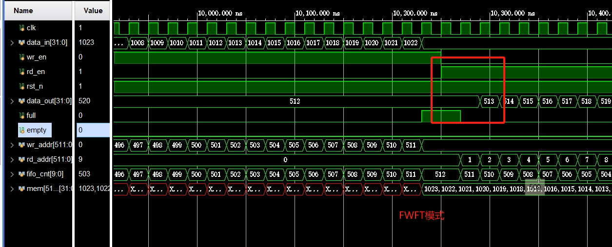
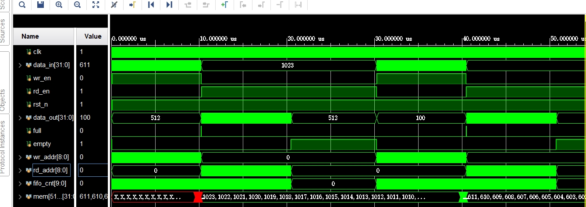
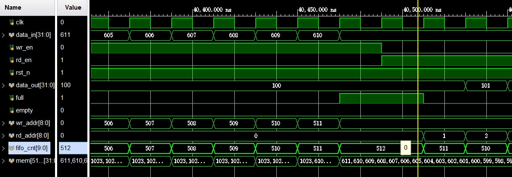
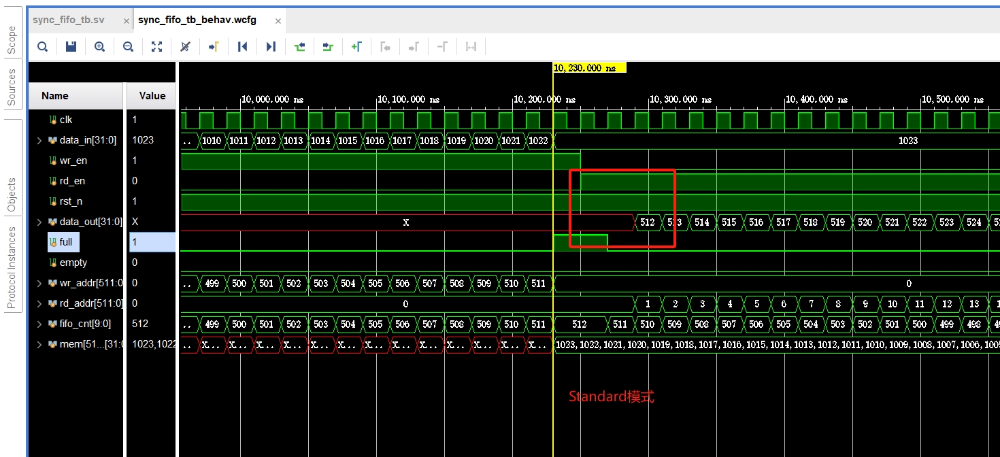
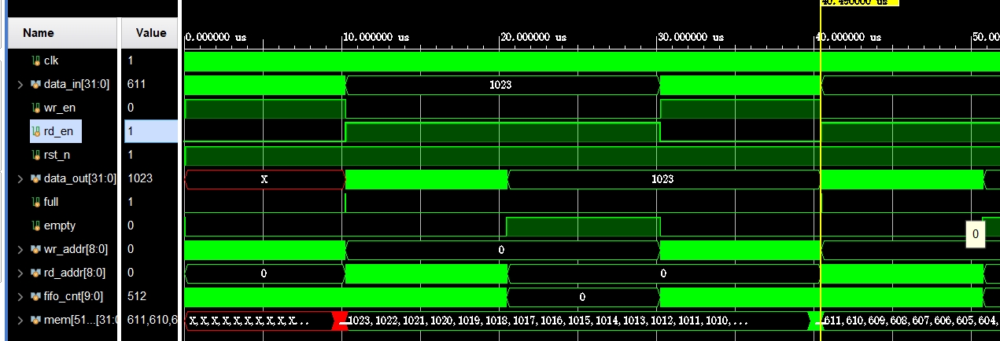
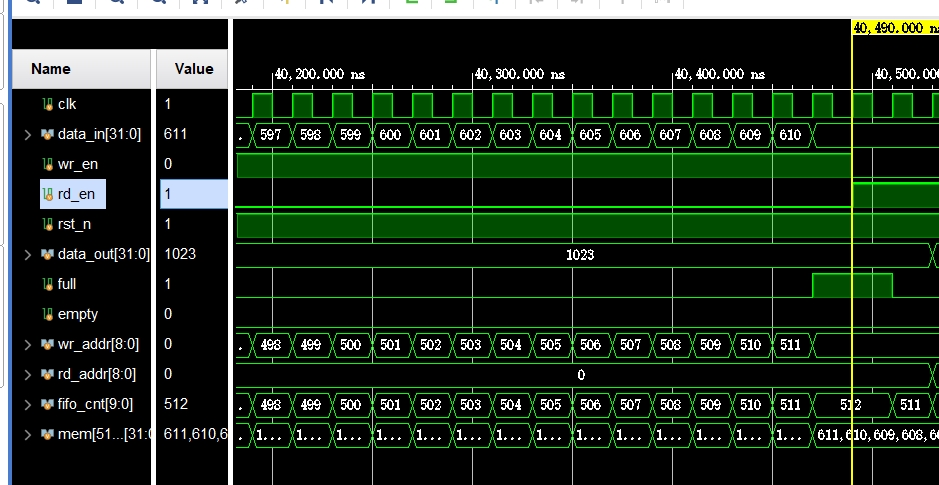
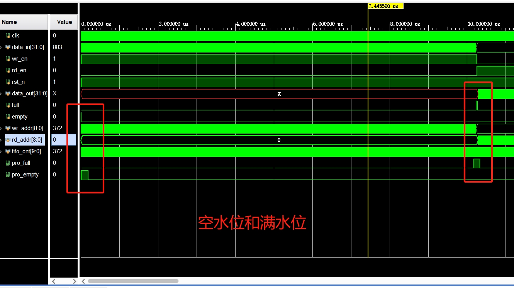

1. FWFT：rd_en有效之前，数据已经准备好
2. Standard：rd_en有效之后，一个周期才读出

FIFO:与RAM的区别在于FIFO先进先出，不能从中间截断读出
## FWFT模式

rd_en有效的时候，就可以立刻读出数据。
### FWFT模式连续两次写读

第二次写读操作局部：

## Standard模式

rd_en有效的时候，需要一个时钟周期后才能读出。
### Standard模式连续两次写读

第二次写读操作局部：

## 水位配置
水位也就是预警。在full之前给出提醒，对于空水位，可以在空之前或之后给出预警。

