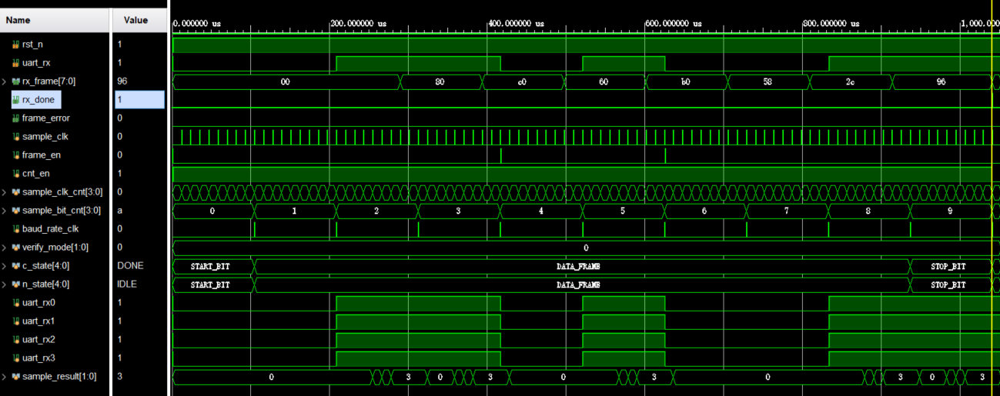
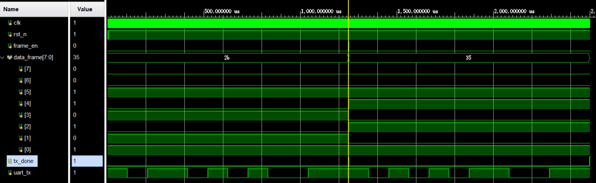
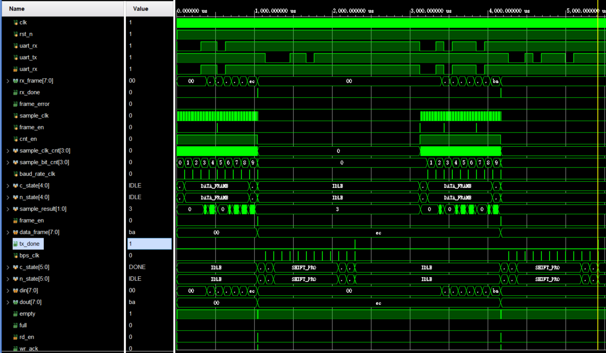
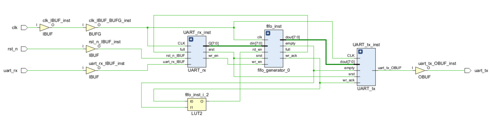
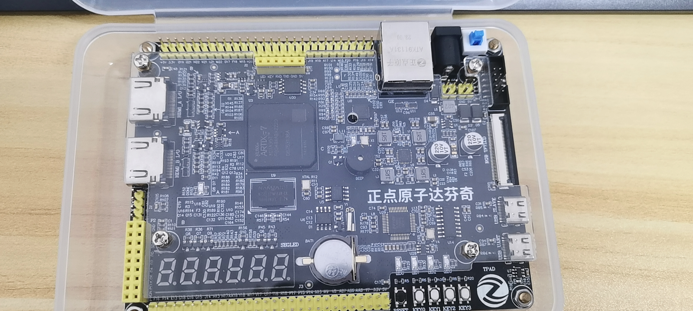
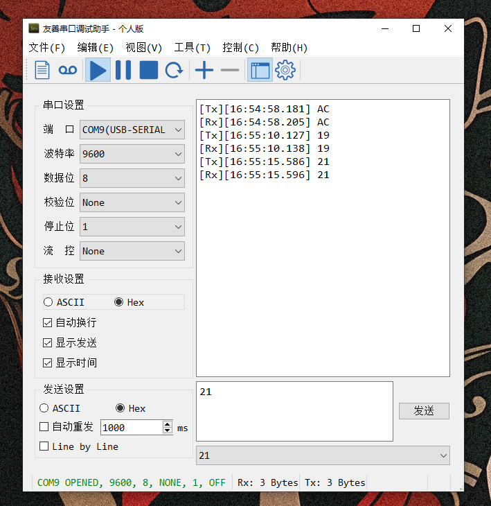

# 1设计说明
本代码设计实现了一个参数化的UART串口通信模块。参数配置位于define.sv文件中。
UART模块包含发送（TX），接收（RX）以及顶层模块，接收模块接收到数据后，将数据通过FIFO传入发送模块，发送模块再对数据进行输出。

# 2仿真结果
设计分别对三个模块进行了仿真。下面为仿真结果：
## 接收（RX）模块仿真波形
 

## 发送（TX）模块仿真波形
 

 ## 顶层模块（top）仿真波形
 

## 原理图
 
# 3上板测试
在RTL级代码设计完成后，使用XC7A35T-2 FGG484开发板进行测试。
## 所用开发板

## 测试结果

